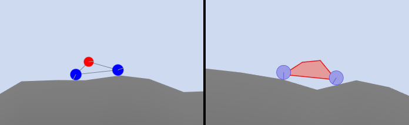

# 2D Car Optimization Sandbox

## About the project

This is an experimental project about visualizing low dimensional complex solution spaces and seeing how a genetic algorithm traverses them.

## How it works

The chosen problem consists of a car driving on a rough terrain in 2D, and the parameters of the car is what makes up the solution space. The fitness of a solution is determined by how long the car is able to drive in a specified amount of time. You can select which car parameters you want the genetic algorithm to optimize. If you select between one and three parameters you will see a texture show up whose pixels represent every solution in the solution space. The coordinates of a pixel decide the parameter values for that solution. The color represents the fitness. If you brute-force all solutions, every pixel in the texture will receive a value and this effectively visualizes the entire solution space. When you start the genetic algorithm, you will see how it moves around the solution space looking for the best solution.

## Features

- Two types of vehicles:
  - Triangle Joint Car
  - Fixture Box Car
- There are 19 car parameters you can select.
- You can modify the min/max range of every parameter.
- The genetic algorithm is configurable.
- Can visualize 1D, 2D and 3D solution spaces and save them as .png.

## Gallery

|  | 
|:--:| 
| *The two types of vehicles that are supported.* |

|  | 
|:--:| 
| *The black and white texture is the solution space of two parameters (chassis XY pos). You can use your cursor to select a car configuration from this texture, and see how well the car performs.* |

|  | 
|:--:| 
| *This is a visualization of a 3D solution space. Three parameters are selected (chassis XY position and radius). The parameter range of the XY chassis position is so large that it intersects with the terrain in certain places, which is why you can see a bit of terrain in this solution space. Solution spaces can look quite interesting when visualized.* |

## Minimum system requirements

- Windows 10 (version 1909 or later)
- Shader model 6.6 capable graphics card and graphics drivers

## Build on Windows

- Install [CMake](https://cmake.org/download/). Version 3.22 or higher is required.
- Ensure CMake is accessible from the command line. 
- For Visual Studio: Run `build.cmd`. Generated project files will appear in `/build/`. 
- For other:
  ```
  cmake -B build
  cmake --build build --config Release
  ```
- CMake will automatically download AgilitySDK if needed and place it in the build folder.

## Third Party Libraries

- [iglo](https://github.com/c-chiniquy/iglo)
- [Box2D](https://github.com/erincatto/box2d)
- [ImGui](https://github.com/ocornut/imgui)
- [ImPlot](https://github.com/epezent/implot)
- [ini.h](https://github.com/mattiasgustavsson/libs/blob/main/ini.h)

